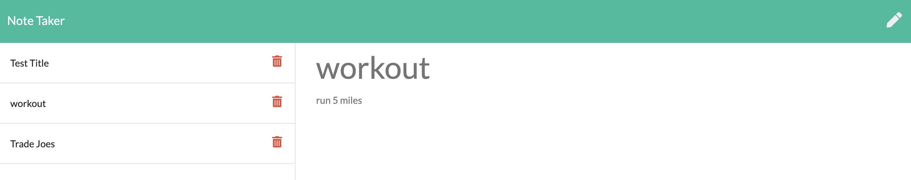

## Note Taker

This application is a note taker that allows users to write, save, and delete notes using an express backend by saving and retreiving data from a JSON file.

## link to Heroku live page

Test it out below!

link -> https://quiet-wildwood-49295.herokuapp.com/notes

## Background Detail

- The application `db.json` file on the backend is used to store and retrieve notes.

- Below are the purposes of each API route:

  - GET `/api/notes` - Reads the `db.json` file and return all saved notes as JSON.

  - POST `/api/notes` - Receive a new note and save it on the request body, add it to the `db.json` file, and then return the new note to the client.

  - DELETE `/api/notes/:id` - Query parameter containing the id of a note to delete

## User Story

AS A user, I want to write and save notes
I WANT to delete notes I've written before
SO THAT I can organize my thoughts

## Business Context

For users that need to keep track of a lot of information, it's easy to forget or be unable to recall something important. Being able to take persistent notes allows users to have written information available when needed.

---

<<<<<<< HEAD

2020 Matt Milici

# Note Taker

=======

2020 Matt Milici

# Note Taker

> > > > > > > 47f7ff4f236603dcf058d471904fce8be79d67be
